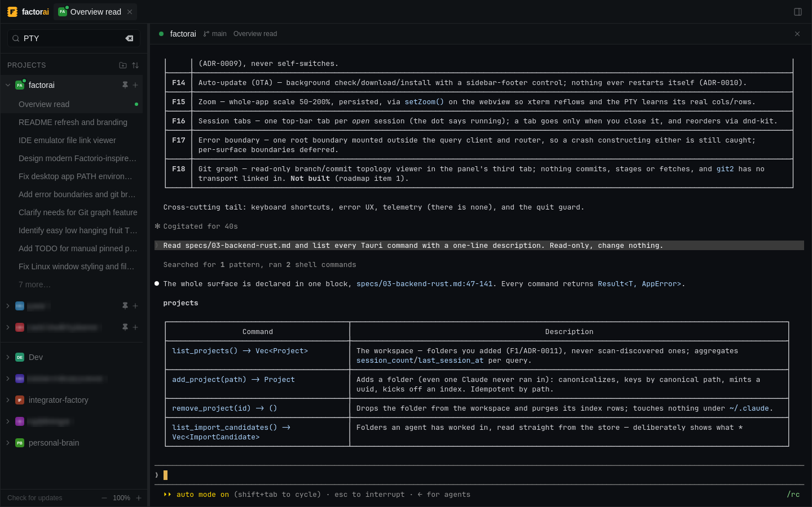
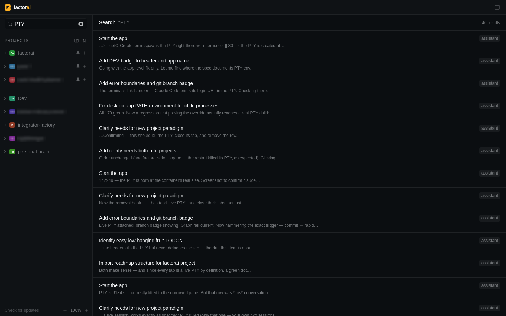
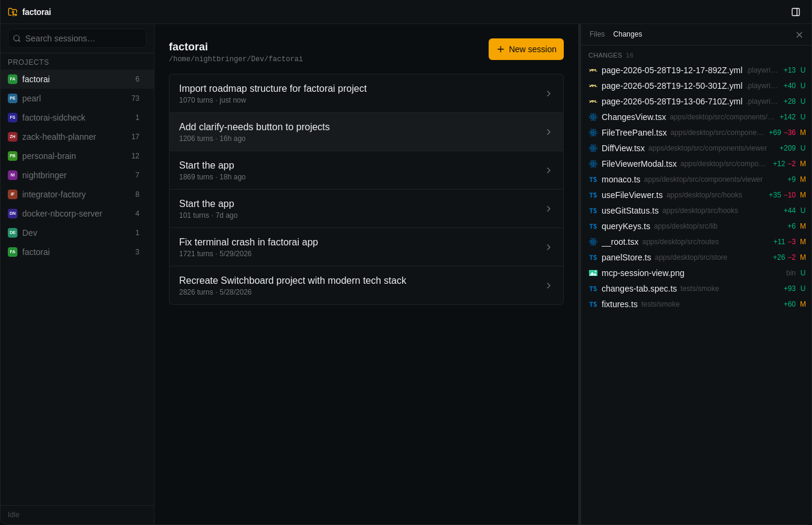
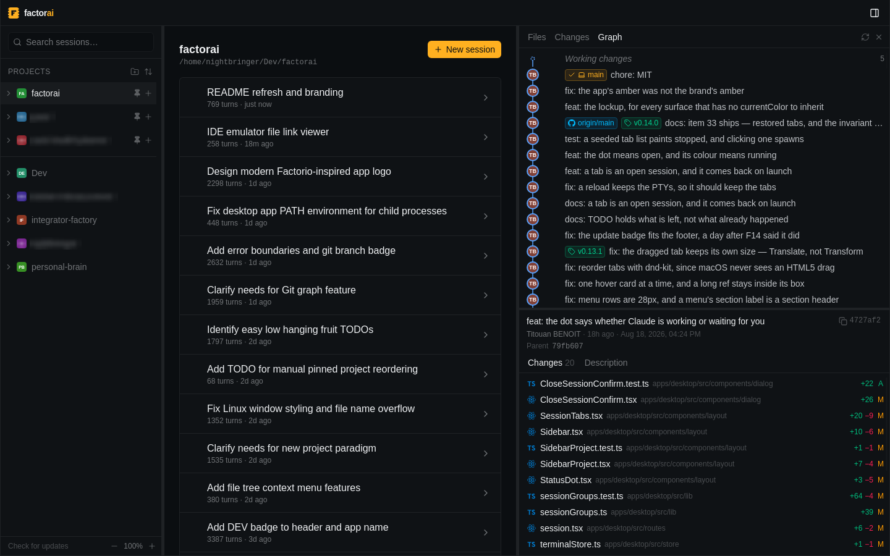

<div align="center">


### IDE is dead. Long live the ADE

Agentic Development Environment for the AI era

[](https://github.com/Nightbr/factorai/releases)
[](#install)
[](https://github.com/Nightbr/factorai/actions/workflows/quality.yml)
[](LICENSE)

</div>

> [!WARNING]
> **factorai is alpha.** It is used daily by its author and by very few other
> people. Releases go out several times a day and publish themselves; things
> move, break and get renamed without ceremony. It drives real agent sessions
> against real repositories, so point it at work your version control can
> recover. [What's next and what just landed](specs/roadmap/).

You stopped writing most of the code. Your editor never noticed. It still opens
files one at a time, still assumes the cursor is the thing that matters, still
treats the terminal running your agent as a rectangle at the bottom of the
screen.

factorai is built the other way round. **The unit of work is a session, not a
file** — agents are long-lived processes you launch, watch, resume and kill, and
reading code is something you do to *check on* the work.

---

### Run agents, not chats

Every session is a real PTY with xterm.js in front of it — the actual `claude`
CLI, not a reimplementation of it. Launch a new one, resume an old one, stop and
restart it. Terminals **survive navigation**: leave a session, go read a file,
come back, it is still running.

The dot beside each session says what it is doing — *working*, *waiting for
you*, or *stopped* — read from Claude's own terminal title rather than guessed
at, so "is it blocked on a permission prompt?" is answerable from the sidebar.
Open sessions become tabs, and the tabs come back when you relaunch.



### Find the conversation you half-remember

factorai reads `~/.claude/projects/` directly — projects, sessions, titles, turn
counts, timestamps. Nothing is imported, copied or migrated; your transcripts
stay exactly where the CLI put them, and that directory is treated as read-only.

On top of it sits SQLite FTS5 across **every message in every session**, so
"which conversation was that?" takes a second rather than an afternoon of `grep`
through JSONL.



### Inspect what it did to your repo

A **Changes** panel with the usual git grouping — staged, unstaged, conflicts —
line counts per file, and a diff on click. It polls, so it keeps up with an
agent mid-edit.

A **Graph** tab for the history around what just happened: lanes, refs, and who
wrote each commit. And a **file tree** with git decorations — changed files
coloured, dirty folders dotted, ignored ones dimmed — in front of a Monaco
viewer with syntax highlighting and rendered markdown.





---

**Nothing leaves your machine.** No telemetry, no analytics, no crash reporting.
No account, no server, no sync — factorai reads local files and runs local
processes, and it never handles your credentials: it drives the `claude` CLI you
have already logged into.

**No orphan agents, ever.** Closing the window with live sessions always
confirms, then kills every child (SIGTERM → SIGKILL). An unattended `claude`
process is real money.

## Install

Grab the `.dmg` (macOS) or `.AppImage` (Linux) from
[Releases](https://github.com/Nightbr/factorai/releases). Both **update
themselves** — factorai checks on launch and every six hours, stages the new
version in the background, and shows `Restart` in the header when it is ready.
Nothing restarts on its own, because a restart kills running sessions.

You also need the [Claude Code CLI](https://claude.com/claude-code), already
authenticated (`claude login`).

<details>
<summary><b>Two things that look like the app is broken, and aren't</b></summary>

<br>

**macOS builds are unsigned.** There is no Apple Developer certificate behind
them, so Gatekeeper refuses the app on first launch with *"damaged and can't be
opened"*. Right-click the app → **Open** → **Open**, or clear the quarantine
attribute yourself:

```bash
xattr -dr com.apple.quarantine /Applications/factorai.app
```

**Linux bundles need glibc 2.39 or newer** — Ubuntu 24.04+, Debian 13+, Fedora
40+. They are built on Ubuntu 24.04, and a glibc-linked binary does not run on
an older release than the one that built it. On Ubuntu 22.04 you will see
`GLIBC_2.38 not found`; build from source there instead.

There is no `.deb`, on purpose: Tauri's updater can replace an AppImage in place
but never a `.deb`, since apt owns those files — and a package that silently
never self-updates is worse than none.

</details>

Building from source, and everything else a contributor needs, is in
[CONTRIBUTING.md](CONTRIBUTING.md).

<div align="center">
<br>
<sub>macOS and Linux. Windows is out of scope for v1.</sub>
</div>
