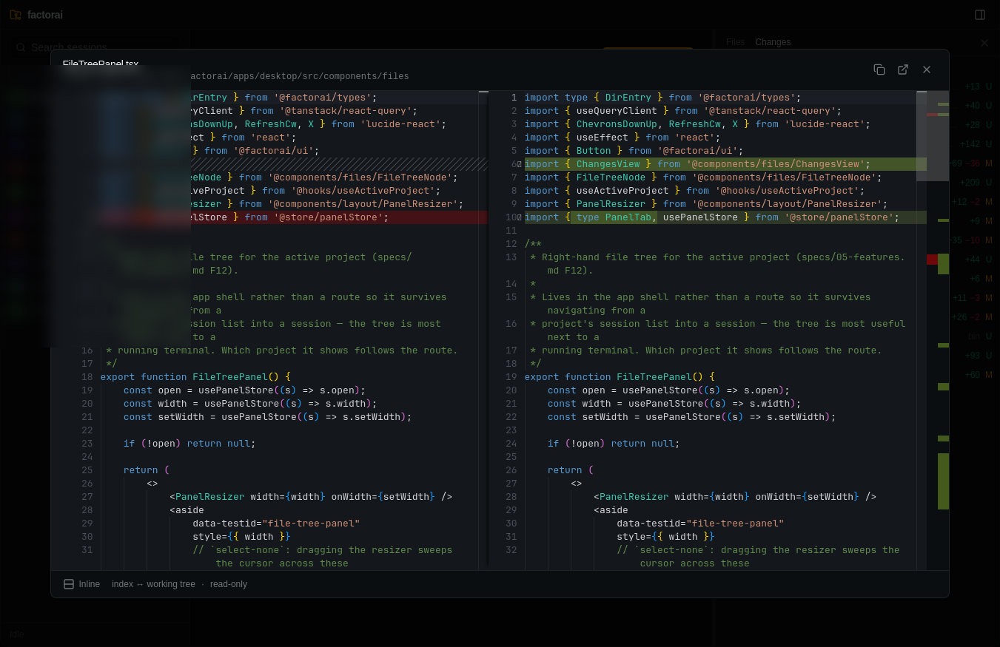

# factorai

> **IDE is dead. Long live the ADE** — the Agentic Development Environment.

You stopped writing most of the code. Your editor never noticed. It still opens
files one at a time, still assumes the cursor is the thing that matters, still
treats the terminal running your agent as a rectangle at the bottom of the
screen.

factorai is built the other way round. The unit of work is a **session**, not a
file. Agents are long-lived processes you launch, watch, resume and kill.
Reading code is something you do to *check on* the work — so it lives beside
the terminal, not in place of it.


## What it does

- **Every Claude Code session, browsable.** Reads `~/.claude/projects/`
  directly — projects, sessions, titles, turn counts, timestamps. Nothing is
  imported or copied; your transcripts stay where the CLI put them.
- **Full-text search over session content.** SQLite FTS5 across every message
  in every session, so "which conversation was that?" takes a second, not an
  afternoon of `grep` in JSONL.
- **Launch, resume, stop and restart sessions in-app.** A real PTY per session
  with xterm.js in front of it. Terminals survive navigation — leave a session,
  come back, it's still running. Status (running / idle / waiting-for-input /
  stopped) bubbles up to the sidebar.
- **Watch what the agent is doing to your repo.** A `Changes` panel with the
  usual git grouping — staged, unstaged, conflicts — line counts per file, and
  a diff on click. It polls, so it keeps up with an agent mid-edit.
- **Browse and read the project.** File tree with git decorations (changed
  files coloured, dirty folders dotted, ignored ones dimmed) and a Monaco
  viewer with syntax highlighting and rendered markdown.
- **No orphan agents, ever.** Closing the window with live sessions always
  confirms, then kills every child (SIGTERM → SIGKILL). An unattended `claude`
  process is real money.



## Status

**Early — usable daily by its author, not yet packaged for anyone else.**

M0–M3 are done (browser, terminal + session lifecycle, search) and M4 is nearly
there — files, the viewer and the git panel have landed; an in-app `CLAUDE.md`
editor is the piece still missing. M5 — settings, keyboard shortcuts, a custom
titlebar and real icons — has not started, so expect rough edges: the icon is a
placeholder, there are no keyboard shortcuts, and the window still wears its OS
decorations.

macOS and Linux only. Windows is explicitly out of scope for v1: `portable-pty`
would probably cope, but nothing about the path encoding or the signing story
has been tested.

## Install

Tagged releases carry bundles built by CI — a universal `.dmg` for macOS and an
`.AppImage` for Linux. Both **update themselves**: factorai checks for a new
release on launch and every six hours, installs it in the background, and shows
`v0.2.0 ready · Restart` in the header when it's staged. Nothing restarts on its
own — a restart kills running agent sessions, so it stays your call.

(No `.deb`: Tauri's updater can replace an AppImage in place but never a `.deb`,
since apt owns those files, and a package that silently never self-updates is
worse than none.)

Grab a build from
[Releases](https://github.com/Nightbr/factorai/releases), or build from source
below.

Two things to know before you download, because both will otherwise look like
the app is broken:

**macOS builds are unsigned.** There's no Apple Developer certificate behind
them, so Gatekeeper refuses the app on first launch with "damaged and can't be
opened". Right-click the app → **Open** → **Open**, or clear the quarantine
attribute yourself:

```bash
xattr -dr com.apple.quarantine /Applications/factorai.app
```

**Linux bundles need glibc 2.39 or newer** — Ubuntu 24.04+, Debian 13+,
Fedora 40+. They're built on Ubuntu 24.04, and a glibc-linked binary doesn't run
on an older release than the one that built it. On Ubuntu 22.04 you'll see
`GLIBC_2.38 not found`; build from source there instead.

## Requirements

- [Claude Code CLI](https://claude.com/claude-code), already authenticated
  (`claude login`). factorai never handles your credentials — it drives the CLI
  you already have.
- [mise](https://mise.jdx.dev/) for the toolchain (Node 24, pnpm 10, Rust
  stable), plus the usual [Tauri 2 system
  dependencies](https://tauri.app/start/prerequisites/) — on Linux that's
  WebKitGTK 4.1 and friends.

## Getting started

```bash
git clone git@github.com:Nightbr/factorai.git
cd factorai
mise install        # toolchain
pnpm install
pnpm dev            # tauri dev — opens the app
```

To produce a bundle (`.dmg` on macOS, `.AppImage` on Linux):

```bash
cd apps/desktop && pnpm tauri build
```

## Development

```bash
pnpm lint           # biome
pnpm typecheck      # tsc --noEmit across the workspace
pnpm test           # vitest
pnpm e2e            # playwright against the renderer in browser-only mode

pnpm --filter @factorai/desktop vite:dev   # renderer alone, no Rust

cd apps/desktop/src-tauri
cargo clippy --all-targets -- -D warnings
cargo test
```

The renderer detects whether it's inside Tauri and falls back to a mock bridge
when it isn't, which is what makes the Playwright lane possible without a
backend. `scripts/qa/` drives the real window for boot-level checks.

## How it's built

Tauri 2 (Rust) + React 19 + TypeScript, in a pnpm/Turborepo monorepo, with
Biome as the single lint/format gate.

A few choices worth knowing, each with an ADR in [`docs/adr/`](docs/adr/):

- **The session index is SQLite + FTS5**, rebuilt by a watcher on
  `~/.claude/projects`. `~/.claude/` itself is treated as **read-only** — the
  CLI owns it.
- **Terminals are real PTYs** (`portable-pty`), with output shipped to the
  renderer as base64 **bytes**: Claude's ANSI breaks if you chunk it as UTF-8.
- **Git state comes from libgit2**, not by shelling out to `git` — a GUI app
  can't count on inheriting a shell `PATH`, and this is a read that runs every
  few seconds.
- **Sessions are named by factorai**, which picks the id and hands it to
  `claude --session-id`, so a new session is linkable and watchable before the
  agent has printed a byte.

## Non-goals

No telemetry, no analytics, no crash reporting. No account, no server, no sync
— it reads local files and runs local processes. No Windows in v1, no
localization, and no code generation for the Tauri bindings (the two sides of
every IPC type are hand-mirrored on purpose, so drift shows up in review).

## Docs

- [`specs/`](specs/) — the design source of truth: architecture, data model,
  the full command surface, feature-by-feature behaviour, milestones.
- [`specs/roadmap/`](specs/roadmap/) — what's next, in priority order, and a
  dated log of what shipped with the gotchas found on the way.
- [`docs/adr/`](docs/adr/) — decisions and why, including the ones that were
  superseded.
- [`AGENTS.md`](AGENTS.md) — how coding agents are expected to work in this
  repo. `CLAUDE.md` is a symlink to it.
