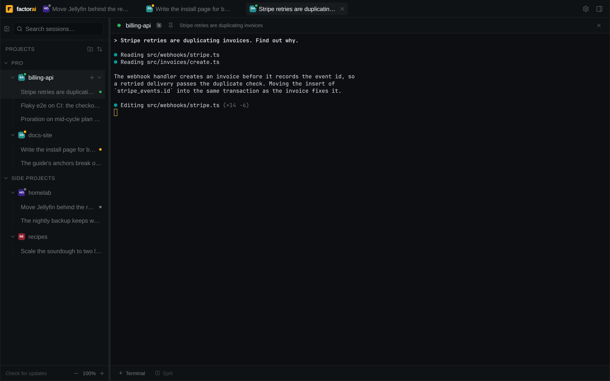
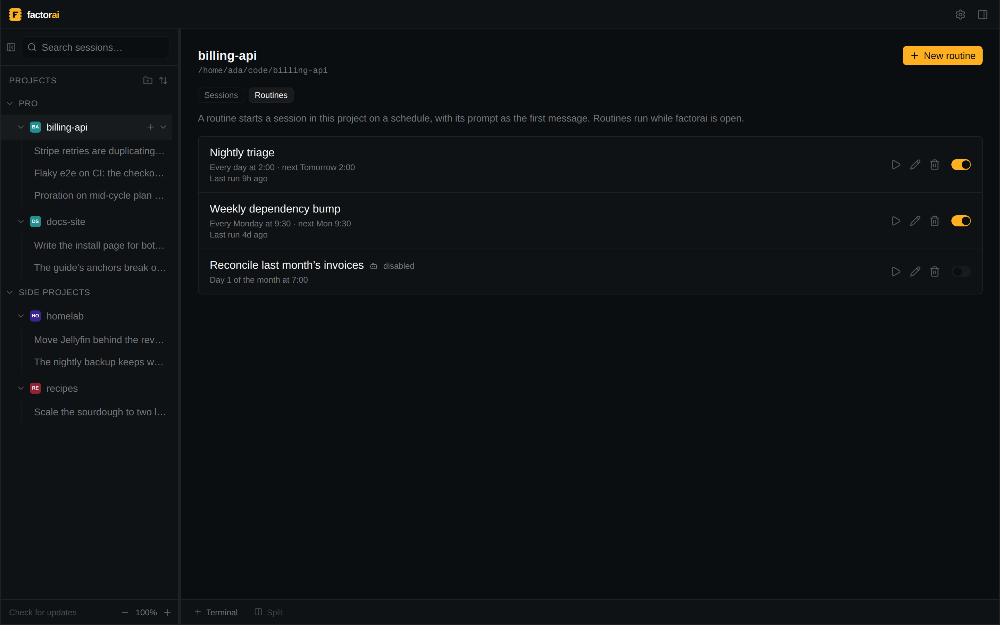
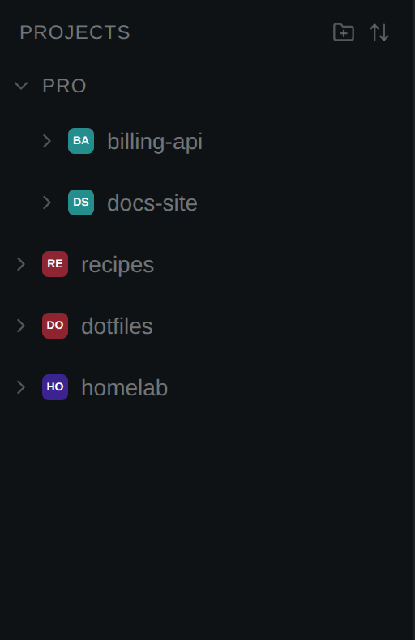
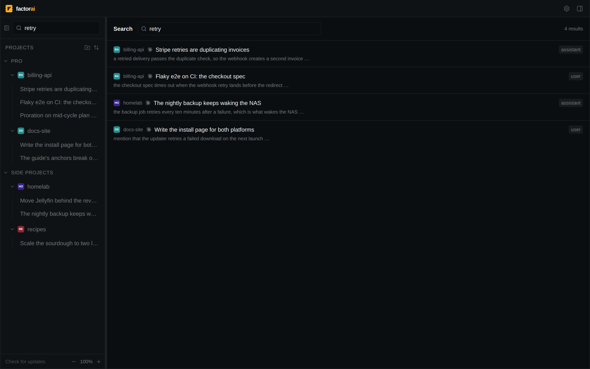
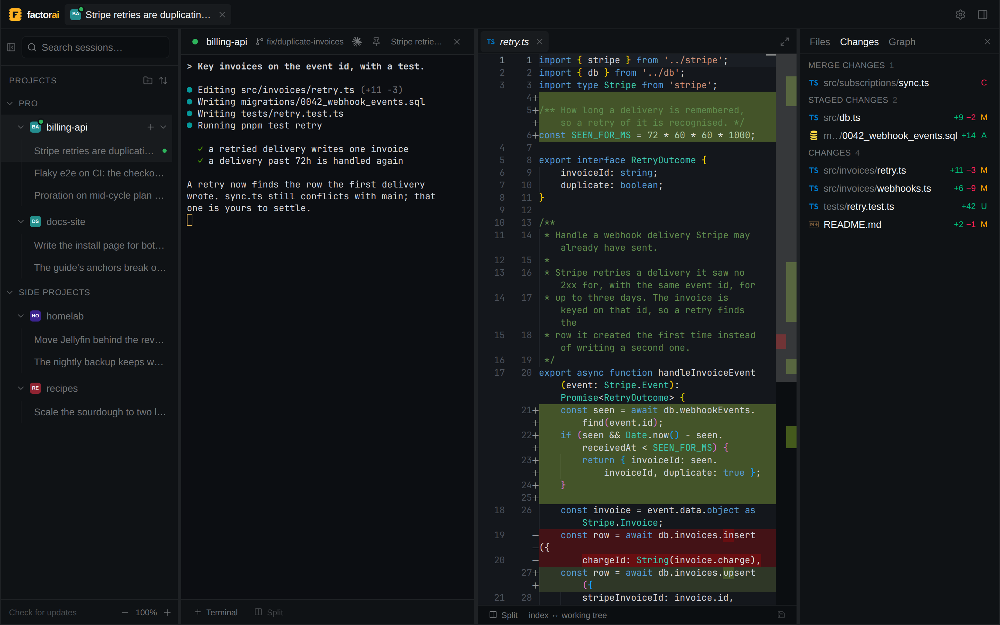
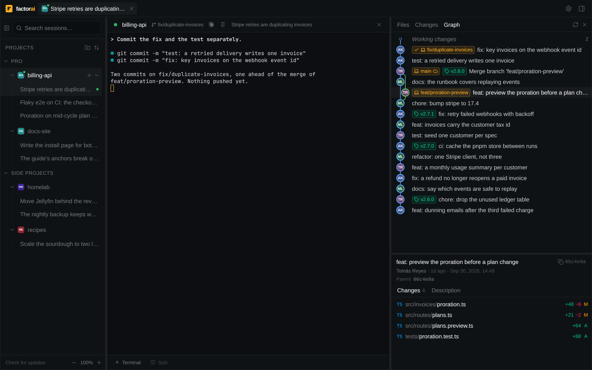

### IDE is dead. Long live the ADE

Agentic Development Environment for the AI era

[Download](https://factorai.build/#download) · [Guide](https://factorai.build/docs/first-run) · [Roadmap](https://github.com/users/Nightbr/projects/1) · [Contributing](CONTRIBUTING.md)

> [!NOTE]
> **factorai is early, and used every day by several senior engineers.** It
> ships on two channels, and you pick one in **Settings → Advanced → Update
> channel**:
>
> - **Stable**, the default. A release only reaches it once alpha users have
>   run it. Choose this unless you want fixes the day they land.
> - **Alpha**. Every app change that passes CI on `main` builds itself and ships,
>   often several times a day. Fixes arrive first, and so do the rough edges.
>
> Both update themselves, and moving from alpha back to stable never
> downgrades: you stay where you are until the next stable release catches up.
> Either way factorai drives real agent sessions against real repositories, so
> point it at work your version control can recover.

You stopped writing most of the code. Your editor never noticed. It still opens
files one at a time, still assumes the cursor is the thing that matters, still
treats the terminal running your agent as a rectangle at the bottom of the
screen.

factorai is built the other way round. **The unit of work is a session, not a
file.** Agents are long-lived processes you launch, watch, resume and kill, and
reading code is something you do to *check on* the work. **You supervise,
decide, review, and set the rules. Agents do the rest.**

It is a free, community-driven open-source project: no company behind it, no
paid tier, and none planned. Issues, ideas and pull requests set the roadmap.

---

### Run several agents at once

Every session is a real PTY with xterm.js in front of it — the actual `claude`
or `codex` CLI, not a reimplementation of it. Claude Code and Codex sit side by
side; a project runs whichever its profile says, and the chevron beside `+`
starts the other. Launch a new one, resume an old one, stop and
restart it. Terminals **survive navigation**: leave a session, go read a file,
come back, it is still running.

The dot beside each session says what it is doing — *working*, *waiting for
you*, or *stopped* — read from the agent's own terminal title rather than
guessed at, so "is it blocked on a permission prompt?" is answerable from the sidebar.
Open sessions become tabs, and the tabs come back when you relaunch.

### Agents on a schedule

A **routine** is a saved prompt with a cron behind it, kept per project: a
nightly triage, a dependency sweep, a lint gate on the hour. When one comes due,
factorai starts a session with that prompt as its first message — **without
opening a tab**, so a project's scheduled work does not take the window away
from what you are doing. Its dot is blue while it runs in the background, and
opening it makes it an ordinary session with an ordinary tab.

Routines run while factorai is open, and a run missed while it was closed is
caught up at launch.

### Arranged the way you think

Projects sit where you drag them, in groups you name — Pro, Side projects, whatever you think in.
Drop one on a group to file it, on the edge to leave it beside, or hold it over
another project to group the two. `Alt`+arrows and `Move to group` do the same
from the keyboard, and `Name` or `Recent` sort when you would rather have a rule
than an arrangement.

### Every message, every session

factorai reads `~/.claude/projects/` and `~/.codex/sessions/` directly —
projects, sessions, titles, turn counts, timestamps. Nothing is imported, copied
or migrated; your transcripts stay exactly where each CLI put them, and those
directories are treated as read-only.

On top of it sits SQLite FTS5 across **every message in every session**, so
"which conversation was that?" takes a second rather than an afternoon of `grep`
through JSONL.

### Audit whenever you choose

A **Changes** panel with the usual git grouping — staged, unstaged, conflicts —
line counts per file, and a diff on click. It polls, so it keeps up with an
agent mid-edit.

A **Graph** tab for the history around what just happened: lanes, refs, and who
wrote each commit. And a **file tree** with git decorations — changed files
coloured, dirty folders dotted, ignored ones dimmed — in front of a Monaco
viewer with syntax highlighting and rendered markdown.

---

**Nothing leaves your machine.** No telemetry, no analytics, no crash reporting.
No account, no server, no sync — factorai reads local files and runs local
processes, and it never handles your credentials: it drives the `claude` or
`codex` CLI you have already logged into.

**No orphan agents, ever.** Closing the window with live sessions always
confirms, then kills every child (SIGTERM → SIGKILL). An unattended agent
process is real money.

## Install

Grab the `.dmg` (macOS), the `.AppImage` (Linux) or `factorai-setup.exe`
(Windows) from [factorai.build](https://factorai.build/#download) or
[Releases](https://github.com/Nightbr/factorai/releases). They **update
themselves** — factorai checks on launch and every six hours, stages the new
version in the background, and shows `Restart` in the header when it is ready.
Nothing restarts on its own, because a restart kills running sessions. A new
install follows the stable channel; switch to alpha in **Settings → Advanced**
(see the note at the top).

You also need at least one agent CLI, already authenticated:
[Claude Code](https://claude.com/claude-code) (`claude login`) or
[Codex](https://developers.openai.com/codex/cli) (`codex login`).

**On Windows, factorai runs inside WSL 2.** It is the Linux build in your own
distribution, shown as a normal window by WSLg — not a native port. That is on
purpose: your repositories, your toolchain and your CLI logins live in the
distribution, and reaching them from Windows goes over a network filesystem that
is slow and where file watching does not work at all. `factorai-setup.exe`
checks the machine, installs into your default distribution and puts factorai in
the Start menu. It never installs WSL for you — if something is missing it tells
you the command to run.

Needs Windows 10 21H2 (build 19044) or Windows 11, x86_64, with WSL 2. ARM64
Windows is not supported. Keep your projects inside the distribution, under `~`
— a folder on `/mnt/c` works, but the session list will not update on its own
there and git is slow, and factorai marks such a project with a warning.

<b>Four things that look like the app is broken, and aren't</b>

 

**macOS asks for permissions one more time on v0.52.0.** Folder access, and App
Management (*"factorai was prevented from modifying apps on your Mac"*) if you
update into it from an older version. Builds are now signed with a Developer ID
and notarized, the signing identity changed, and macOS ties each grant to it.
Allow them once and they stay allowed from then on, updates included. If folder permissions keep coming back on every release,
you are on a build at or before v0.32.0 — those grants were tied to the exact
build, and every release voided them.

**Linux bundles need glibc 2.39 or newer** — Ubuntu 24.04+, Debian 13+, Fedora
40+. They are built on Ubuntu 24.04, and a glibc-linked binary does not run on
an older release than the one that built it. On Ubuntu 22.04 you will see
`GLIBC_2.38 not found`; build from source there instead.

There is no `.deb`, on purpose: Tauri's updater can replace an AppImage in place
but never a `.deb`, since apt owns those files — and a package that silently
never self-updates is worse than none.

**Windows warns that it protected your PC** when you run `factorai-setup.exe`,
because the installer is unsigned. Click **More info** → **Run anyway**. It is
unsigned for a concrete reason rather than an oversight: there is no free
Authenticode certificate authority — since June 2023 CAs must keep code-signing
keys on dedicated hardware — and self-signing changes nothing a user sees on
Windows. An application to SignPath Foundation, which is free for open-source
projects, is in flight. The Linux binary the installer places is signed the way
every other release is, and the app verifies its own updates.

**Reveal in file manager does nothing on Windows.** There is no file manager on
WSL's session bus for the app to ask. External links work.

Building from source, and everything else a contributor needs, is in
[CONTRIBUTING.md](CONTRIBUTING.md).

 
macOS, Linux, and Windows through WSL 2.

